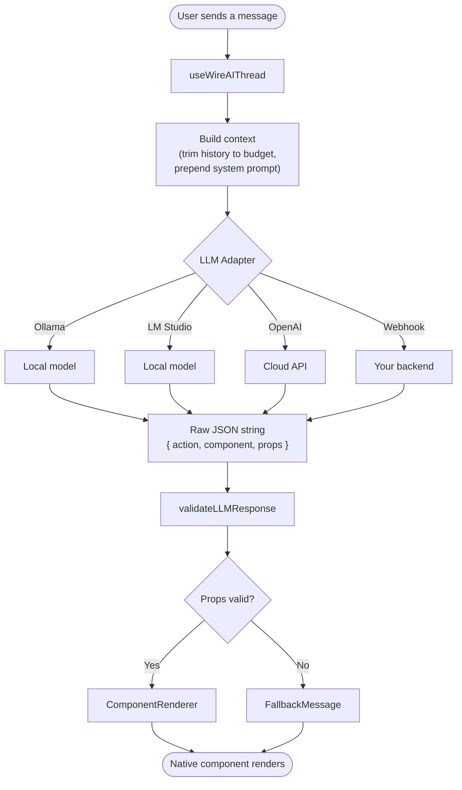
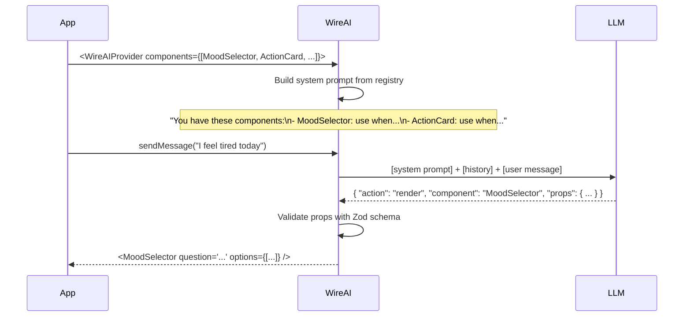
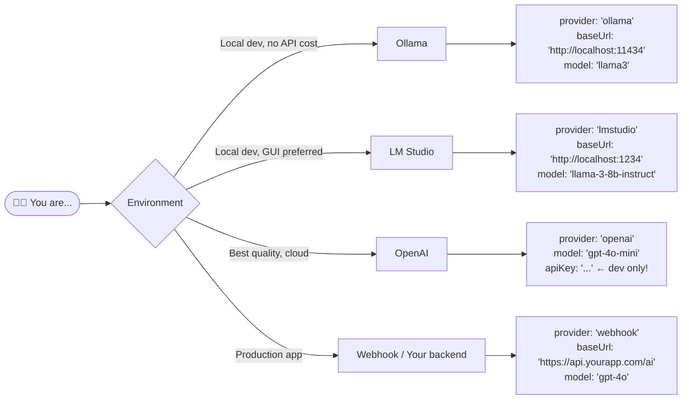
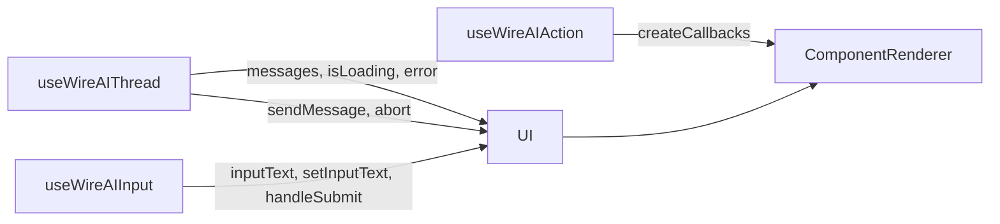
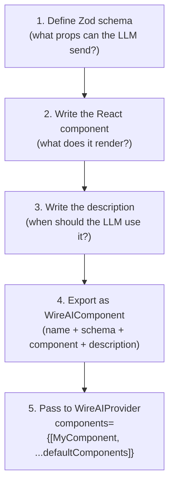
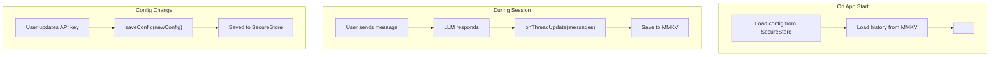
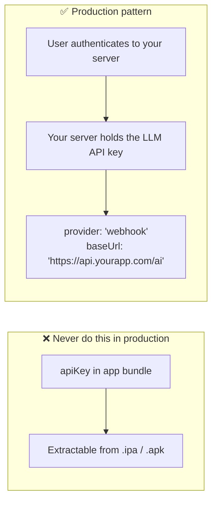

# wireai-rn

**Wire your AI agent to native mobile UI.**

Open-source React Native SDK for generative UI — render interactive native components from LLM responses. No custom parsers. No prompt engineering. Works with Ollama, LM Studio, OpenAI, A2A agents, or any HTTP agent endpoint.

[](https://www.npmjs.com/package/wireai-rn)
[](https://www.npmjs.com/package/wireai-rn)
[](https://github.com/chohra-med/wireai-rn/blob/main/LICENSE)
[](https://www.npmjs.com/package/wireai-rn)
[](https://github.com/chohra-med/wireai-rn)

Created by [**Malik Chohra**](https://getwireai.com?utm_source=wireai-rn&utm_medium=readme&utm_campaign=creator). Sponsored by [AI Mobile Launcher](https://aimobilelauncher.com?utm_source=wireai-rn&utm_medium=readme&utm_campaign=sponsor) and [CasaInnov](https://casainnov.com?utm_source=wireai-rn&utm_medium=readme&utm_campaign=sponsor).

```tsx
// Your agent returns JSON. Wire RN renders it as native components, validated.
<WireAIProvider llm={config} components={defaultComponents}>
  <ChatScreen />
</WireAIProvider>
```

---

## Contents

- [The Problem](#the-problem)
- [Quick Start](#quick-start)
- [How It Works](#how-it-works)
- [Install](#install)
- [Step-by-Step Guide](#step-by-step-guide)
- [Composition (nested components)](#composition--nested-components)
- [Streaming](#streaming--progressive-ui-as-tokens-arrive)
- [Built-in Components](#built-in-components-11)
- [LLM Provider Reference](#llm-provider-reference)
- [API Reference](#hooks-reference)
- [Security](#security)
- [Design Tokens](#design-tokens)
- [Sponsors](#sponsors)
- [Contributing](#contributing)
- [License](#license)

---

## Quick Start

```bash
npm install wireai-rn zod
```

```tsx
import { WireAIProvider } from "wireai-rn";
import { defaultComponents } from "wireai-rn/components";

const config = { provider: "openai" as const, model: "gpt-4o-mini", apiKey: "..." };

export default function App() {
  return (
    <WireAIProvider llm={config} components={defaultComponents}>
      <ChatScreen />
    </WireAIProvider>
  );
}
```

That is the whole setup. Your agent returns `{ action, component, props }`, Wire RN validates the props against the component's Zod schema, and renders a native React Native component. No WebView, no HTML, no hand-written parser. The full chat screen is in [Step 3](#step-3--build-a-chat-screen).

---

## The Problem

AI agents speak text. Mobile users expect native UI.

Your agent works — it answers questions, follows instructions, produces useful output. But in React Native you have three bad options: a text chat that feels like 2018, a WebView wrapper that feels cheap, or a custom UI that takes months.

**WireAI fills this gap.** Register your components with a description and a Zod schema. The LLM picks which one to show. WireAI validates the props and renders it natively.

---

## How It Works



---

## How the LLM Chooses a Component

WireAI auto-generates a system prompt from your registered components. The LLM reads it and decides which component fits the conversation.



---

## Install

```bash
npm install wireai-rn zod
# or
yarn add wireai-rn zod
```

**Peer dependencies:**
```json
{
  "react": ">=18.0.0",
  "react-native": ">=0.73.0",
  "zod": ">=3.22.0"
}
```

> Zod v3 only. Zod v4 has breaking API changes.

---

## Step-by-Step Guide

### Step 1 — Pick your LLM provider



| Provider | When to use | Cold start | Cost |
|---|---|---|---|
| **Ollama** | Local development, privacy | ~2s | Free |
| **LM Studio** | Local development, GUI | ~2s | Free |
| **OpenAI** | Best quality + zero setup | <1s | Pay per token |
| **Webhook** | Production (server holds keys) | <1s | Your backend |

---

### Step 2 — Wrap your app

```tsx
import { WireAIProvider } from "wireai-rn";
import { defaultComponents } from "wireai-rn/components"; // 11 built-in components

const LLM_CONFIG = {
  provider: "ollama" as const,
  baseUrl: "http://localhost:11434",
  model: "llama3",
};

export default function App() {
  return (
    <WireAIProvider llm={LLM_CONFIG} components={defaultComponents}>
      <ChatScreen />
    </WireAIProvider>
  );
}
```

`WireAIProvider` does three things on mount:
1. Registers all your components into an in-memory registry
2. Builds the LLM system prompt from the registry (auto-generated, no manual prompt writing needed)
3. Pings your LLM endpoint in `__DEV__` to confirm connectivity

---

### Step 3 — Build a chat screen

```tsx
import {
  useWireAIThread,
  useWireAIInput,
  useWireAIAction,
  ComponentRenderer,
  LoadingState,
} from "wireai-rn";
import type { Message } from "wireai-rn";
import {
  FlatList,
  KeyboardAvoidingView,
  TextInput,
  Text,
  TouchableOpacity,
  View,
} from "react-native";
import { useRef, useEffect } from "react";

export function ChatScreen() {
  const { messages, isLoading, error, sendMessage, abort } = useWireAIThread();
  const { inputText, setInputText, handleSubmit } = useWireAIInput(sendMessage);
  const createCallbacks = useWireAIAction(sendMessage);
  const listRef = useRef<FlatList>(null);

  // Auto-scroll to newest message
  useEffect(() => {
    if (messages.length) {
      setTimeout(() => listRef.current?.scrollToEnd({ animated: true }), 100);
    }
  }, [messages.length]);

  const renderItem = ({ item }: { item: Message }) => {
    if (item.role === "user") {
      return (
        <View style={{ alignSelf: "flex-end", padding: 8, backgroundColor: "#6C47FF", borderRadius: 12, margin: 4 }}>
          <Text style={{ color: "#fff" }}>{item.content}</Text>
        </View>
      );
    }
    if (item.role === "assistant" && item.response) {
      return (
        <ComponentRenderer
          messageId={item.id}
          response={item.response}
          callbackOverrides={createCallbacks(item.id)}
        />
      );
    }
    return null;
  };

  return (
    <KeyboardAvoidingView style={{ flex: 1 }} behavior="padding">
      <FlatList
        ref={listRef}
        data={messages}
        keyExtractor={(m) => m.id}
        renderItem={renderItem}
        contentContainerStyle={{ padding: 16 }}
      />

      {isLoading && <LoadingState />}
      {error && <Text style={{ color: "red", padding: 8 }}>{error}</Text>}

      <View style={{ flexDirection: "row", padding: 8, gap: 8 }}>
        <TextInput
          style={{ flex: 1, borderWidth: 1, borderRadius: 8, padding: 8 }}
          value={inputText}
          onChangeText={setInputText}
          onSubmitEditing={handleSubmit}
          placeholder="Type a message..."
          returnKeyType="send"
        />
        <TouchableOpacity
          onPress={isLoading ? abort : handleSubmit}
          style={{ padding: 8, backgroundColor: "#6C47FF", borderRadius: 8 }}
        >
          <Text style={{ color: "#fff" }}>{isLoading ? "Stop" : "Send"}</Text>
        </TouchableOpacity>
      </View>
    </KeyboardAvoidingView>
  );
}
```

**Hooks at a glance:**



---

### Step 4 — Register a custom component

Custom components give the LLM new capabilities specific to your app.



**Full example:**

```tsx
import React, { useCallback, useState } from "react";
import { Pressable, StyleSheet, Text, View } from "react-native";
import { z } from "zod";
import { colors, spacing, radii, textStyles } from "wireai-rn";
import type { WireAIComponent } from "wireai-rn";

// 1. Schema — every field needs .describe() so the LLM knows what to fill in
const schema = z.object({
  question: z.string().describe("The mood check-in question, e.g. 'How are you feeling right now?'"),
  options: z.array(z.string()).describe("4-6 mood labels, warm and non-clinical"),
});

// 2. React component
const MoodSelectorView: React.FC<z.infer<typeof schema> & { onSelect?: (v: string) => void }> =
  React.memo(({ question, options, onSelect }) => {
    const [selected, setSelected] = useState<string | null>(null);

    const handlePress = useCallback((opt: string) => {
      if (selected) return; // one-shot: lock after first tap
      setSelected(opt);
      onSelect?.(opt);
    }, [selected, onSelect]);

    return (
      <View style={styles.card}>
        <Text style={styles.question}>{question}</Text>
        {options.map((opt) => (
          <Pressable
            key={opt}
            style={[styles.chip, selected === opt && styles.chipSelected]}
            onPress={() => handlePress(opt)}
            disabled={!!selected}
          >
            <Text style={[styles.chipText, selected === opt && styles.chipTextSelected]}>
              {opt}
            </Text>
          </Pressable>
        ))}
      </View>
    );
  });

// 3 + 4. Export definition — description is a routing instruction for the LLM
export const MoodSelector: WireAIComponent<typeof schema> = {
  name: "MoodSelector",
  description:
    "Use when checking the user's current mood or emotional state at the start of a session. " +
    "Provide 4-6 warm, non-clinical mood labels as options. " +
    "Do NOT use for yes/no questions — use ConfirmPrompt instead.",
  component: MoodSelectorView,
  propsSchema: schema,
};

const styles = StyleSheet.create({
  card: { padding: spacing.md, backgroundColor: colors.backgroundSecondary, borderRadius: radii.lg, gap: spacing.sm },
  question: { ...textStyles.h4, color: colors.text },
  chip: { padding: spacing.sm, borderRadius: radii.full, borderWidth: 1, borderColor: colors.border, alignItems: "center" },
  chipSelected: { backgroundColor: colors.primary, borderColor: colors.primary },
  chipText: { color: colors.textSecondary },
  chipTextSelected: { color: "#fff", fontWeight: "600" },
});
```

Then pass it to the provider alongside the built-ins:

```tsx
<WireAIProvider components={[MoodSelector, ...defaultComponents]}>
```

**Component description writing rules:**

| Do | Don't |
|---|---|
| `"Use when the user needs to pick a mood"` | `"A mood picker card"` |
| `"Do NOT use for yes/no — use ConfirmPrompt"` | (no negative routing) |
| `"Provide 4-6 options, warm and non-clinical"` | (no output guidelines) |
| Reference other components by name | Reference your app's business logic |

---

### Step 5 — Add persistence (optional)

Without persistence, conversations reset on every app restart. WireAI supports any storage backend through the `StorageBackend` interface.



**Install storage libraries:**

```bash
# API key + LLM config → iOS Keychain / Android Keystore
npx expo install expo-secure-store

# Conversation history → high-performance key-value store
yarn add react-native-mmkv
```

**Create storage backends:**

```ts
// storage/secureStorageBackend.ts
import * as SecureStore from "expo-secure-store";
import type { StorageBackend } from "wireai-rn";

export const secureStorageBackend: StorageBackend = {
  getItem: (key) => SecureStore.getItemAsync(key),
  setItem: (key, value) => SecureStore.setItemAsync(key, value),
  deleteItem: (key) => SecureStore.deleteItemAsync(key),
};
```

```ts
// storage/mmkvHistoryStorage.ts
import { MMKV } from "react-native-mmkv";
import type { StorageBackend } from "wireai-rn";

const store = new MMKV({ id: "chat-history" });

export const mmkvHistoryStorage: StorageBackend = {
  getItem: async (key) => store.getString(key) ?? null,
  setItem: async (key, value) => store.set(key, value),
  deleteItem: async (key) => store.delete(key),
};
```

**Wire it all together:**

```tsx
import { useLLMConfigStorage, WireAIProvider } from "wireai-rn";
import type { Message } from "wireai-rn";
import { useCallback, useEffect, useState } from "react";
import { secureStorageBackend } from "./storage/secureStorageBackend";
import { mmkvHistoryStorage } from "./storage/mmkvHistoryStorage";

const DEFAULT_CONFIG = { provider: "openai" as const, model: "gpt-4o-mini" };
const HISTORY_KEY = "chat_history_v1";

export function AppRoot() {
  // Config — persisted in SecureStore
  const { config, isLoaded, saveConfig } = useLLMConfigStorage(
    secureStorageBackend,
    DEFAULT_CONFIG
  );

  // History — loaded from MMKV on first mount
  const [initialMessages, setInitialMessages] = useState<Message[]>([]);
  const [historyLoaded, setHistoryLoaded] = useState(false);

  useEffect(() => {
    mmkvHistoryStorage.getItem(HISTORY_KEY).then((raw) => {
      if (raw) {
        try { setInitialMessages(JSON.parse(raw)); } catch {}
      }
      setHistoryLoaded(true);
    });
  }, []);

  // Stable callback — called with the full message array on every update
  const handleThreadUpdate = useCallback((messages: Message[]) => {
    mmkvHistoryStorage.setItem(HISTORY_KEY, JSON.stringify(messages));
  }, []);

  if (!isLoaded || !historyLoaded) return null; // wait for storage reads

  return (
    <WireAIProvider
      llm={config}
      components={defaultComponents}
      initialMessages={initialMessages}
      onThreadUpdate={handleThreadUpdate}
    >
      <ChatScreen />
    </WireAIProvider>
  );
}
```

---

## Composition — nested components

A container component can declare a `children` slot in its Zod schema using the exported `NodeRefSchema`. The renderer recurses into the tree, validates each node against the registered component's schema, and hands the container ready-to-mount React elements (pre-rendered in place of the raw `NodeRef[]`).

**1. Declare a container:**

```tsx
import { NodeRefSchema } from "wireai-rn";
import type { WireAIComponent } from "wireai-rn";
import { z } from "zod";
import React from "react";
import { View, Text, StyleSheet } from "react-native";

const cardSchema = z.object({
  title: z.string().describe("Card heading"),
  children: z
    .array(NodeRefSchema)
    .optional()
    .describe("Nested child components — text, charts, status cards, etc."),
});

// The SDK pre-renders the children array into ReactNode[] before passing it
// down, so the container just lays them out.
const CardView: React.FC<z.infer<typeof cardSchema>> = ({ title, children }) => (
  <View style={styles.card}>
    <Text style={styles.title}>{title}</Text>
    {children as unknown as React.ReactNode}
  </View>
);

export const Card: WireAIComponent<typeof cardSchema> = {
  name: "Card",
  description:
    "A container holding a heading plus a list of nested components. Use when you need to group related child components under a single title.",
  component: CardView as React.ComponentType<z.infer<typeof cardSchema> & { messageId: string }>,
  propsSchema: cardSchema,
};

const styles = StyleSheet.create({
  card: { padding: 16, borderRadius: 12, backgroundColor: "#fff", gap: 8 },
  title: { fontSize: 17, fontWeight: "600" },
});
```

**2. The LLM emits a tree:**

```json
{
  "action": "render",
  "component": "Card",
  "props": {
    "title": "Trip Summary",
    "children": [
      { "component": "MessageBubble", "props": { "message": "Lisbon, Sept 12–18" } },
      { "component": "StatusCard",    "props": { "status": "success", "title": "Booked", "ctaLabel": "What's next?" } }
    ]
  }
}
```

The renderer walks the tree, validates each node's props against its registered schema, and substitutes the `children` array with `ReactNode[]` before `Card` mounts.

**Notes:**
- Max nesting depth is 8. Beyond that, the offending subtree renders `FallbackMessage`.
- One bad subtree never kills the whole message — each level is wrapped in `ComponentErrorBoundary`, and per-node validation failures degrade to a localized fallback.
- For dynamic layouts where the SDK can't auto-locate children, the component receives an injected `renderNode(child)` helper that turns a single `NodeRef` into a `ReactNode`.

---

## Streaming — progressive UI as tokens arrive

Adapters that implement `chatStream` (currently `OpenAIAdapter` and `WebhookAdapter`) push tokens through an XHR-based stream. The thread hook parses partial JSON on each chunk and publishes the best-effort partial response to a small pub/sub store keyed by `messageId`. Subscribe with `useWireAIStream` to render only the bubble that's streaming — the rest of the conversation doesn't re-render.

**Render a streaming bubble:**

```tsx
import { ComponentRenderer, LoadingState, useWireAIStream } from "wireai-rn";
import type { Message } from "wireai-rn";

function AssistantBubble({ message }: { message: Message }) {
  const stream = useWireAIStream(message.id);
  const response = stream?.response ?? message.response;
  if (!response) return <LoadingState />;
  return (
    <ComponentRenderer
      messageId={message.id}
      response={response}
      isStreaming={stream?.isStreaming ?? message.isStreaming ?? false}
    />
  );
}
```

**Why XHR (not fetch)?** React Native's `fetch` does not expose `response.body` as a `ReadableStream`, so true progressive reads are only available through `XMLHttpRequest.onprogress`. The adapter accumulates `xhr.responseText` and forwards new bytes to your `onChunk` callback.

**Webhook server contract.** When using `WebhookAdapter.chatStream`, your server must respond with `Transfer-Encoding: chunked` and stream the assistant's raw JSON text progressively. If your server wraps responses in `{ content: ... }`, either strip the wrapper before streaming or use the non-streaming `chat()` method.

**Behavior during a stream:**
- A placeholder assistant `Message` is inserted immediately when you call `sendMessage`. It carries `isStreaming: true` and an empty `content` until the final chunk arrives.
- The stream store holds the latest partial. Nodes whose props don't yet pass strict Zod validation silently render `null` until the next chunk fills them in (no fallback flicker).
- On the final chunk, the strict validator runs against the full buffer. On success, the placeholder is replaced with the finalized message and the stream store entry is cleared. On failure, the placeholder is removed and `error` is set.
- Aborting (e.g. user taps Stop) tears down the XHR; no late `onChunk` callbacks fire.

**Falls back automatically.** Adapters without `chatStream` (Ollama, LM Studio, A2A) keep the existing one-shot path. No code change needed in your app to support the mix.

---

## Built-in Components (11)

Import from `wireai-rn/components`. All are Zod-validated, `React.memo`-wrapped, and include submitted-state protection (no double-submit).

| Component | Use When | Key Props |
|---|---|---|
| `ActionCard` | Offering 1–3 next-step CTA buttons | `title`, `actions[{ label, value }]` |
| `ChipSelectCard` | Quick selection from compact labels (moods, tags, activities) | `question`, `options[]`, `multiSelect?` |
| `ConfirmPrompt` | Binary yes/no decision before an action | `question`, `confirmLabel?`, `cancelLabel?` |
| `ContentSelectCard` | Selecting from items with title + description | `title`, `items[{ title, description, value }]` |
| `InfoList` | Displaying read-only key/value summary data | `title`, `items[{ label, value }]` |
| `MessageBubble` | Standard text chat response | `message`, `sender?` |
| `NumberStepperCard` | Picking a number within a range | `label`, `min`, `max`, `step?`, `defaultValue?` |
| `SelectionCard` | Choosing one option from a list with longer labels | `title`, `options[{ label, value, description? }]` |
| `StatusCard` | Success, error, or informational status display | `status`, `title`, `message?` |
| `StepList` | Ordered steps or itinerary | `title`, `steps[]` |
| `TextInputCard` | Collecting free-text input (name, goal, note) | `label`, `placeholder?`, `submitLabel?` |

---

## LLM Provider Reference

```tsx
const config: LocalLLMConfig = {
  provider: "ollama" | "lmstudio" | "openai" | "webhook",
  baseUrl: "...",
  model: "...",
  apiKey?: "...",           // OpenAI / Webhook auth
  timeoutMs?: 30000,        // default: 30s
  temperature?: 0.7,        // default: 0.7
  maxTokens?: 1024,         // default: 1024
};
```

| Provider | Default base URL | Ping endpoint | Notes |
|---|---|---|---|
| `ollama` | `http://localhost:11434` | `GET /api/tags` | Physical device: use LAN IP |
| `lmstudio` | `http://localhost:1234` | `GET /v1/models` | Start server in LM Studio first |
| `openai` | `https://api.openai.com` | `GET /v1/models` | Strips `/v1` suffix if present in `baseUrl` |
| `webhook` | _(required)_ | skipped | `POST /` with `{ messages, model }` |

---

## WireAIProvider Props

```tsx
<WireAIProvider
  llm={config}                      // Required — LLM connection config
  components={components}            // Required — WireAIComponent[] registry
  maxContextMessages={20}            // Max messages kept in context (default: 20)
  maxContextChars={12000}            // Max chars in context (~3k tokens, default: 12000)
  systemPromptSuffix="You are..."   // Append app-specific instructions to auto-generated prompt
  initialMessages={[]}               // Pre-populate thread (e.g. from storage)
  onMessage={(msg) => {}}            // Called with each new message (analytics hook)
  onThreadUpdate={(msgs) => {}}      // Called with full thread on every update (persistence hook)
>
  {children}
</WireAIProvider>
```

---

## Hooks Reference

### `useWireAIStream(messageId)`

```ts
const stream = useWireAIStream(messageId);
// stream?.response   — latest partial WireAIResponse (or undefined)
// stream?.isStreaming — true until the final chunk arrives
```

Used inside per-message bubbles when the adapter supports `chatStream`. Re-renders are coalesced via `requestAnimationFrame` so a fast token stream doesn't flood React.

### `useWireAIThread()`

```ts
const {
  messages,     // Message[] — full conversation history
  isLoading,    // boolean — LLM request in flight
  error,        // string | null — last error message
  sendMessage,  // (text: string) => Promise<void>
  abort,        // () => void — cancel in-flight request
} = useWireAIThread();
```

### `useWireAIInput(sendMessage)`

```ts
const {
  inputText,    // string — controlled input value
  setInputText, // Dispatch<SetStateAction<string>>
  handleSubmit, // () => void — trims + sends + clears input
} = useWireAIInput(sendMessage);
```

### `useWireAIAction(sendMessage)`

Returns a factory that creates callback props for interactive components.

```ts
const createCallbacks = useWireAIAction(sendMessage);

// In renderItem:
<ComponentRenderer
  messageId={item.id}
  response={item.response}
  callbackOverrides={createCallbacks(item.id)}
  // ^ injects onSelect, onConfirm, onSubmit etc. that send messages back to the thread
/>
```

### `useLLMConfigStorage(storage, defaultConfig)`

```ts
const {
  config,       // LocalLLMConfig — current resolved config
  isLoaded,     // boolean — false until storage read completes
  saveConfig,   // (config: LocalLLMConfig) => Promise<void>
  clearConfig,  // () => Promise<void> — resets to defaultConfig
} = useLLMConfigStorage(storage, defaultConfig);
```

| Param | Type | Description |
|---|---|---|
| `storage` | `StorageBackend` | Any `{ getItem, setItem, deleteItem }` implementation |
| `defaultConfig` | `LocalLLMConfig` | Fallback config if nothing is stored yet |

---

## Context Budget

WireAI automatically trims old messages when the conversation grows:

```
maxContextMessages = 20   ← drop oldest messages beyond this count
maxContextChars = 12000   ← drop oldest messages beyond this char limit
```

The system prompt is always prepended fresh and is never trimmed. A dev warning fires at 80% utilization so you can tune before hitting limits.

```tsx
<WireAIProvider
  maxContextMessages={30}  // increase for long sessions
  maxContextChars={20000}  // increase for GPT-4o (128k context)
>
```

---

## Security



- **Local LLMs** (Ollama, LM Studio): no API key needed — safe for production if the model runs on the device or a private server
- **Cloud LLMs in dev**: `apiKey` is fine in `__DEV__` mode, but WireAI logs a warning
- **Cloud LLMs in production**: always use `WebhookAdapter` with a server-side proxy

---

## Design Tokens

Use these in your custom components to stay visually consistent with the built-ins:

```tsx
import { colors, spacing, radii, textStyles } from "wireai-rn";

// Colors
colors.primary          // #6C47FF — violet
colors.text             // #0D0D14 — near-black
colors.textSecondary    // #6B7280 — muted
colors.backgroundSecondary // surface cards
colors.border           // subtle stroke

// Spacing
spacing.xs   // 4
spacing.sm   // 8
spacing.md   // 16
spacing.lg   // 24
spacing.xl   // 32

// Radii
radii.sm     // 6
radii.md     // 10
radii.lg     // 16
radii.full   // 999 (pill)

// Text styles (spread into StyleSheet)
textStyles.h3    // 20px semibold
textStyles.h4    // 17px semibold
textStyles.body  // 15px regular
textStyles.small // 13px regular
```

---

## Contributing

```bash
git clone git@github.com:chohra-med/wireai-rn.git
cd wireai-rn/packages/core
yarn install
yarn build      # ESM + CJS + .d.ts (tsup)
yarn test       # jest — 87 tests across 9 suites
yarn typecheck
```

See [CONTRIBUTING.md](https://github.com/chohra-med/wireai-rn/blob/main/CONTRIBUTING.md) for pull request guidelines.

---

## Sponsors

Wire RN is open source and free. Its development is backed by:

- **[AI Mobile Launcher](https://aimobilelauncher.com?utm_source=wireai-rn&utm_medium=readme&utm_campaign=sponsor)** — the AI-native React Native boilerplate. Ship an AI mobile app with local + cloud LLMs, generative UI, and a paywall already wired.
- **[CasaInnov](https://casainnov.com?utm_source=wireai-rn&utm_medium=readme&utm_campaign=sponsor)** — AI-native mobile product studio. Done-for-you AI mobile builds and fractional CTO work.

Want your product here? Open an issue or reach out at [getwireai.com](https://getwireai.com?utm_source=wireai-rn&utm_medium=readme&utm_campaign=sponsor-inquiry).

---

## License

MIT — see [LICENSE](../../LICENSE) for details.

---

Created by **[Malik Chohra](https://getwireai.com?utm_source=wireai-rn&utm_medium=readme&utm_campaign=creator)** — React Native engineer, building AI-native mobile.
[Website](https://getwireai.com?utm_source=wireai-rn&utm_medium=readme&utm_campaign=footer) · [Newsletter](https://codemeetai.substack.com?utm_source=wireai-rn&utm_medium=readme&utm_campaign=newsletter) · [X / @malik_chohra](https://x.com/malik_chohra)

Sponsored by [AI Mobile Launcher](https://aimobilelauncher.com?utm_source=wireai-rn&utm_medium=readme&utm_campaign=sponsor) and [CasaInnov](https://casainnov.com?utm_source=wireai-rn&utm_medium=readme&utm_campaign=sponsor).
